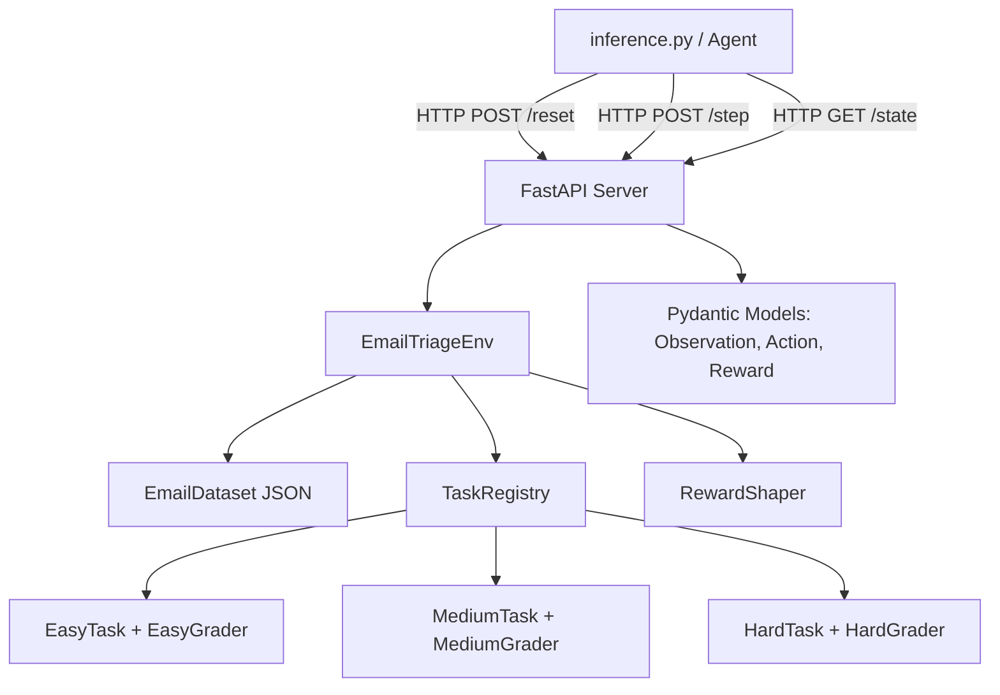

# Design Document: OpenEnv Email Triage

## Overview

OpenEnv Email Triage is a real-world reinforcement learning environment where an AI agent manages a synthetic corporate inbox. The agent must triage emails by categorizing, prioritizing, drafting replies, and escalating messages — tasks that mirror genuine knowledge-worker workflows.

The environment implements the OpenEnv specification (Gymnasium-style `step/reset/state` API) and deploys as a FastAPI server inside a Docker container on a Hugging Face Space. Three tasks of increasing difficulty (easy → medium → hard) provide a clear difficulty progression for benchmarking agent capabilities.

**Why email triage?**
- Genuinely useful: email management is a high-value real-world task
- Rich action space: multiple action types with structured parameters
- Natural difficulty gradient: categorization → prioritization → reply drafting
- Deterministic grading: keyword matching and category comparison are fully programmatic
- Partial-credit rewards: every step provides a learning signal

---

## Architecture



**Key design decisions:**
- The environment core (`EmailTriageEnv`) is a pure Python class with no HTTP dependency, enabling direct unit testing.
- The FastAPI server is a thin wrapper that serializes/deserializes Pydantic models and delegates to the env.
- Tasks and graders are registered in a `TaskRegistry` dict, making it trivial to add new tasks.
- The email dataset is a static JSON file bundled with the package — no external dependencies at runtime.
- Reward shaping is isolated in a `RewardShaper` class to keep grader logic separate from step-level feedback.

---

## Components and Interfaces

### EmailTriageEnv

The central environment class. Holds all mutable state for a single episode.

```python
class EmailTriageEnv:
    def __init__(self, task: str = "easy", seed: int = 42): ...
    def reset(self) -> Observation: ...
    def step(self, action: Action) -> tuple[Observation, Reward, bool, dict]: ...
    def state(self) -> dict: ...
```

**State fields:**
- `task_name: str` — current task ("easy", "medium", "hard")
- `seed: int` — RNG seed for reproducibility
- `inbox: list[Email]` — shuffled list of emails for this episode
- `current_index: int` — pointer to the current email
- `step_count: int` — number of steps taken
- `max_steps: int` — step limit for the task
- `actions_taken: dict[str, list[str]]` — maps email_id → list of action_types taken (for duplicate detection)
- `episode_actions: list[EpisodeAction]` — full action log for grading

### TaskRegistry

```python
TASK_REGISTRY: dict[str, TaskConfig] = {
    "easy":   TaskConfig(name="easy",   email_count=10, max_steps=20,  grader=EasyGrader()),
    "medium": TaskConfig(name="medium", email_count=20, max_steps=40,  grader=MediumGrader()),
    "hard":   TaskConfig(name="hard",   email_count=30, max_steps=60,  grader=HardGrader()),
}
```

### Graders

Each grader implements a common interface:

```python
class BaseGrader:
    def score(self, episode_actions: list[EpisodeAction], ground_truth: list[Email]) -> float: ...
```

- `EasyGrader`: scores 0.1 per correct category, max 1.0
- `MediumGrader`: scores 0.05 per correct category + 0.025 per correct priority (±1 tolerance), max 1.0
- `HardGrader`: scores 0.02 per correct category + 0.015 per correct priority + 0.015 per reply with ≥1 required keyword, max 1.0

### RewardShaper

Computes per-step reward components:

```python
class RewardShaper:
    def compute(self, action: Action, email: Email, task_name: str,
                actions_taken: dict) -> Reward: ...
```

Reward components (summed and clamped to [0.0, 1.0]):
| Component | Condition | Value |
|---|---|---|
| correct_category | category matches ground truth | +0.10 / +0.05 / +0.02 |
| correct_priority | priority within ±1 of ground truth | +0.025 / +0.015 |
| reply_quality | reply contains ≥1 required keyword | +0.015 |
| duplicate_penalty | same action_type on same email_id again | -0.05 |
| urgent_archive_penalty | archive action on urgent email | -0.10 |

### FastAPI Server

```python
app = FastAPI()

@app.post("/reset")   -> ObservationResponse
@app.post("/step")    -> StepResponse
@app.get("/state")    -> dict
@app.get("/health")   -> dict
```

The server holds a single global `EmailTriageEnv` instance (sufficient for single-agent use). For concurrent use, a session-keyed dict can be added later.

---

## Data Models

### Email (internal, from dataset)

```python
class Email(BaseModel):
    id: str
    subject: str
    sender: str
    body: str
    timestamp: str          # ISO 8601
    category: str           # "business" | "support" | "spam" | "urgent"
    priority: int           # 1–5 (ground truth)
    required_keywords: list[str]  # for reply grading (hard task)
    labels: list[str]       # display labels (no ground truth leaked)
```

### Observation (API surface)

```python
class CurrentEmailView(BaseModel):
    id: str
    subject: str
    sender: str
    body: str
    timestamp: str
    labels: list[str]       # does NOT include category/priority ground truth

class InboxSummary(BaseModel):
    total: int
    processed: int
    remaining: int

class Observation(BaseModel):
    current_email: CurrentEmailView
    inbox_summary: InboxSummary
    step: int
```

### Action (API surface)

```python
class ActionType(str, Enum):
    categorize = "categorize"
    prioritize = "prioritize"
    reply      = "reply"
    archive    = "archive"
    escalate   = "escalate"
    skip       = "skip"

class Action(BaseModel):
    action_type: ActionType
    target_email_id: str
    category: Optional[str] = None        # for categorize
    priority: Optional[int] = Field(None, ge=1, le=5)  # for prioritize
    reply_body: Optional[str] = None      # for reply
    escalation_reason: Optional[str] = None  # for escalate
```

### Reward (API surface)

```python
class Reward(BaseModel):
    value: float = Field(..., ge=0.0, le=1.0)
    reason: str
    partial_scores: dict[str, float]
```

### StepResponse (HTTP wrapper)

```python
class StepResponse(BaseModel):
    observation: Observation
    reward: Reward
    done: bool
    info: dict
```

---

## Email Dataset Design

The dataset (`data/emails.json`) contains 30 synthetic emails. Distribution:

| Category | Count | Priority Range | Notes |
|---|---|---|---|
| business | 8 | 2–4 | Meeting requests, project updates |
| support | 8 | 1–3 | Help desk tickets, user questions |
| spam | 7 | 1 | Promotional, phishing-style |
| urgent | 7 | 4–5 | Outages, security alerts, deadlines |

**Easy subset (10 emails):** 3 business, 3 support, 2 spam, 2 urgent — chosen for unambiguous signals (clear subject lines, obvious categories).

**Medium subset (20 emails):** adds 5 business, 5 support, 3 spam, 5 urgent — includes some ambiguous cases (e.g., a support ticket with urgent language).

**Hard subset (all 30):** full dataset including complex cases with threading references, time-sensitive escalations, and emails requiring specific reply content.

Each email includes a `required_keywords` list (used only by the hard grader) — e.g., an outage email might require `["acknowledged", "investigating"]` in a valid reply.

---

## Correctness Properties

*A property is a characteristic or behavior that should hold true across all valid executions of a system — essentially, a formal statement about what the system should do. Properties serve as the bridge between human-readable specifications and machine-verifiable correctness guarantees.*

Property 1: Step return shape invariant
*For any* valid action submitted to any task variant of the environment, `step()` must return a 4-tuple of (Observation, Reward, bool, dict) where Observation has all required fields, Reward.value is in [0.0, 1.0], done is a bool, and info is a dict.
**Validates: Requirements 1.2, 2.1, 2.3**

Property 2: Reset produces fresh state
*For any* task name and seed, calling `reset()` twice in sequence must produce observations with identical step=0, identical inbox size, and identical current_email.id (same seed → same shuffle order).
**Validates: Requirements 1.4, 3.6**

Property 3: Invalid action returns error without state mutation
*For any* invalid action (wrong email_id, missing required parameter), `step()` must return reward.value=0.0, done=False, and info containing an "error" key, while the environment's step_count and current_index remain unchanged.
**Validates: Requirements 1.5**

Property 4: Task email count invariant
*For any* task name in {"easy", "medium", "hard"}, after `reset()` the inbox_summary.total must equal the task's configured email count (10, 20, 30 respectively).
**Validates: Requirements 1.7, 3.2, 3.3, 3.4**

Property 5: Reward value range invariant
*For any* sequence of actions on any task, every Reward returned by `step()` must have value in [0.0, 1.0].
**Validates: Requirements 2.3, 5.7**

Property 6: Correct categorization yields positive reward
*For any* email in the dataset and its ground-truth category, submitting a `categorize` action with the correct category must yield a Reward with partial_scores["correct_category"] > 0.
**Validates: Requirements 5.1**

Property 7: Priority tolerance reward
*For any* email and any priority value p, submitting a `prioritize` action yields partial_scores["correct_priority"] > 0 if and only if |p - ground_truth_priority| ≤ 1.
**Validates: Requirements 5.2, 5.3**

Property 8: Reply keyword reward
*For any* email with non-empty required_keywords, submitting a `reply` action whose reply_body contains at least one required keyword must yield partial_scores["reply_quality"] > 0.
**Validates: Requirements 5.4**

Property 9: Grader score range invariant
*For any* sequence of episode actions on any task, the grader's `score()` method must return a float in [0.0, 1.0].
**Validates: Requirements 4.4**

Property 10: All-skip episode scores zero
*For any* task, an episode where every action is `skip` must produce a final grader score of exactly 0.0.
**Validates: Requirements 4.6**

---

## Error Handling

| Scenario | Behavior |
|---|---|
| `action.target_email_id` not in current inbox | Return reward=0, info={"error": "unknown email id"}, no state change |
| `action.action_type == "categorize"` but `category` is None | Return reward=0, info={"error": "category required for categorize action"} |
| `action.action_type == "prioritize"` but `priority` is None | Return reward=0, info={"error": "priority required for prioritize action"} |
| `action.action_type == "reply"` but `reply_body` is None | Return reward=0, info={"error": "reply_body required for reply action"} |
| `action.action_type == "escalate"` but `escalation_reason` is None | Return reward=0, info={"error": "escalation_reason required for escalate action"} |
| Pydantic validation error on Action construction | FastAPI returns HTTP 422 with validation details |
| `OPENAI_API_KEY` not set in inference.py | Exit with code 1 and descriptive message |
| LLM API call fails in inference.py | Log error in [STEP] line, continue with skip action |

---

## Testing Strategy

### Dual Testing Approach

Both unit tests and property-based tests are used. They are complementary:
- Unit tests verify specific examples, edge cases, and error conditions
- Property tests verify universal correctness across randomly generated inputs

### Property-Based Testing

Library: **Hypothesis** (Python)

Each property test runs a minimum of 100 iterations. Tests are tagged with the property they validate.

```python
# Tag format: Feature: openenv-email-triage, Property N: <property_text>
@settings(max_examples=100)
@given(...)
def test_property_N_...(...)
```

**Property test implementations:**

- Property 1: Generate random valid actions using `st.sampled_from(ActionType)` + valid email IDs, assert step() return shape
- Property 2: Generate random task names and seeds, call reset() twice, assert identical initial observations
- Property 3: Generate invalid actions (wrong email_id, missing params), assert error contract
- Property 4: Generate task names from {"easy","medium","hard"}, assert inbox size after reset
- Property 5: Run random action sequences, assert all reward values in [0.0, 1.0]
- Property 6: Generate (email, correct_category) pairs from dataset, assert positive reward component
- Property 7: Generate (email, priority) pairs, assert reward sign matches tolerance condition
- Property 8: Generate (email, reply_body_with_keyword) pairs, assert positive reply_quality score
- Property 9: Generate random action sequences, assert grader score in [0.0, 1.0]
- Property 10: Run all-skip episode, assert score == 0.0

### Unit Tests

Unit tests cover:
- Specific grader scoring examples (known input → expected score)
- Duplicate action penalty (-0.05)
- Urgent archive penalty (-0.10)
- Ground truth exposure only after done=True
- Dataset loading (≥30 emails, unique IDs)
- openenv.yaml structure validation
- FastAPI endpoint contracts (request/response shape)
- Inference script log format parsing

### Test File Structure

```
tests/
  test_env_core.py        # EmailTriageEnv unit + property tests
  test_graders.py         # Grader unit tests
  test_reward_shaper.py   # RewardShaper unit + property tests
  test_models.py          # Pydantic model validation tests
  test_api.py             # FastAPI endpoint tests (TestClient)
  test_dataset.py         # Dataset integrity tests
```
